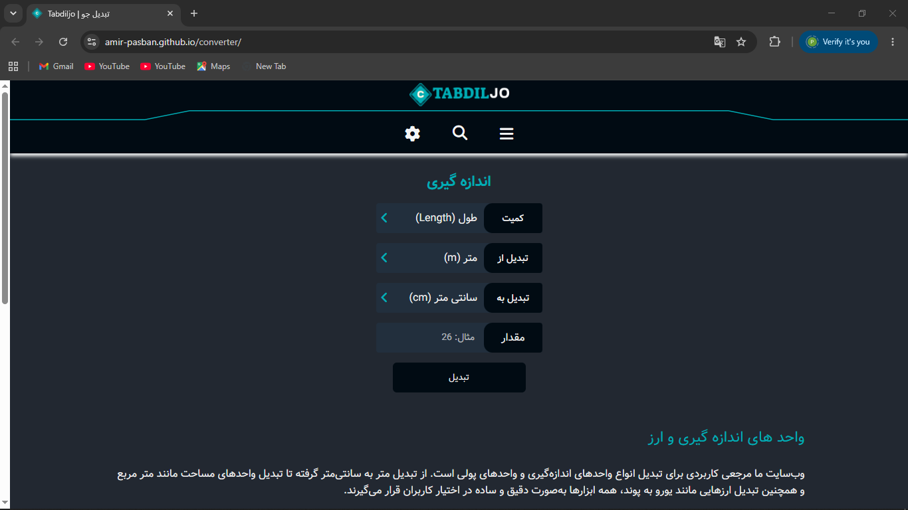

<div align="center">


# TABDIL JO

### Universal Unit & Currency Converter

A modern and responsive web application for converting currencies, lengths, and various measurement units with multilingual support and dark/light themes.

<p>
  <a href="https://amir-pasban.github.io/converter/">Live Demo</a> •
  <a href="https://github.com/amir-pasban/converter">Repository</a>
</p>


</div>

---

# 📖 About The Project

TABDIL JO is a modern web-based conversion platform designed to simplify everyday calculations and unit conversions.

The project currently supports currency and length conversions while offering a clean user experience, multilingual support, responsive design, and customizable themes.

This project was developed to provide a practical conversion solution for real-world use and represents my first complete software project.

---

# ✨ Features

## Current Features

- 💱 Currency Conversion
- 📏 Length Conversion
- 🌐 Multi-language Support
- 🌙 Dark Mode
- ☀️ Light Mode
- 📱 Responsive Design
- ⚡ Fast & Lightweight
- 🎨 Modern User Interface
- 🔍 Easy Navigation
- 🖥️ Desktop & Mobile Support

---

## 🚀 Upcoming Features

- 🌡️ Temperature Conversion
- ⚖️ Weight Conversion
- 📐 Area Conversion
- ⏱️ Time Conversion
- 🔄 Real-Time Exchange Rate API
- 📊 Conversion History
- ⭐ Favorite Conversions
- 📱 Progressive Web App (PWA)
- 🔔 Smart Notifications
- 💾 Local Storage Support

---

# 🏆 Project Highlights

- First complete software project
- Built for real-world usage
- Developed over 1.5 months
- Fully responsive design
- Clean and scalable architecture
- Future-ready for API integration
- Supports multiple languages
- Modern dark-themed interface

---

# 📸 Screenshots

## Mobile View

<p align="center">
  
</p>

## Desktop View



---

# 🛠️ Built With

### Current Technologies

- HTML5
- CSS3
- Responsive Design
- Custom Fonts

### Future Technologies

- JavaScript
- Exchange Rate APIs
- Local Storage
- PWA Technologies

---

# 📂 Project Structure

```text
TABDIL JO
│
├── index.html
├── debug.log
│
├── assets
│   └── photo
│
└── src
    ├── css
    │   ├── all.css
    │   ├── base.css
    │   ├── constant.css
    │   ├── fonts.css
    │   ├── responsive.css
    │   └── style.css
    │
    ├── fonts
    └── webfonts
```

---

# 🚀 Getting Started

## Clone Repository

```bash
git clone https://github.com/amir-pasban/converter.git
```

## Enter Project Directory

```bash
cd converter
```

## Run The Project

Open the following file in your browser:

```text
index.html
```

---

# 🎯 Project Goals

The primary goals of TABDIL JO are:

- Simplify unit conversions
- Improve user productivity
- Provide accurate conversion tools
- Deliver a smooth user experience
- Support both local and international users
- Create a scalable conversion platform

---

# 🗺️ Roadmap

- [x] Project Setup
- [x] Responsive UI Design
- [x] Currency Conversion Layout
- [x] Length Conversion Layout
- [x] Multi-language Support
- [x] Dark/Light Theme
- [ ] JavaScript Conversion Engine
- [ ] Real-Time Currency API
- [ ] Temperature Conversion
- [ ] Weight Conversion
- [ ] Area Conversion
- [ ] Time Conversion
- [ ] Conversion History
- [ ] PWA Support
- [ ] User Preferences Storage

---

# 🌍 Live Demo

Visit the live website:

👉 https://amir-pasban.github.io/converter/

---

# 🤝 Contributing

Contributions, suggestions, and feedback are always welcome.

1. Fork the repository
2. Create your feature branch

```bash
git checkout -b feature/AmazingFeature
```

3. Commit your changes

```bash
git commit -m "Add Amazing Feature"
```

4. Push to the branch

```bash
git push origin feature/AmazingFeature
```

5. Open a Pull Request

---

# 👨‍💻 Developer

### Amir Pasban

GitHub:
https://github.com/amir-pasban

Email:
AmirPasban.dev@gmail.com

---

# 📈 Project Information

| Information | Details |
|------------|---------|
| Project Name | TABDIL JO |
| Project Type | Unit & Currency Converter |
| Status | Active Development |
| Development Time | 1.5 Months |
| First Software Project | Yes |
| Open Source | Yes |
| License | MIT |
| Purpose | Real-World Usage |

---

# 📄 License

This project is licensed under the MIT License.

Feel free to use, modify, and distribute this project according to the license terms.

---

# ⭐ Support

If you like this project, consider giving it a ⭐ on GitHub.

Repository:

https://github.com/amir-pasban/converter

---

<div align="center">

### Made with ❤️ by Amir Pasban

**TABDIL JO — Making Conversions Easier For Everyone**

</div>
